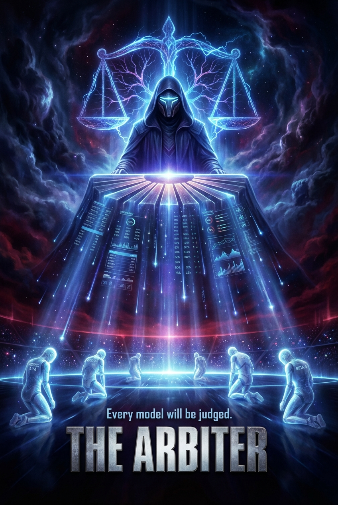
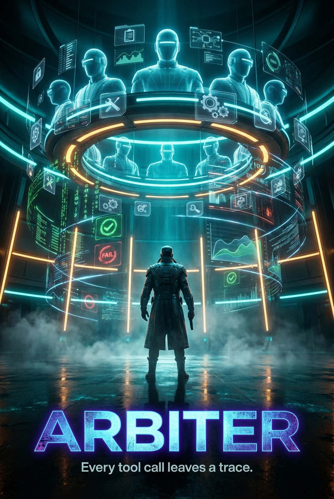
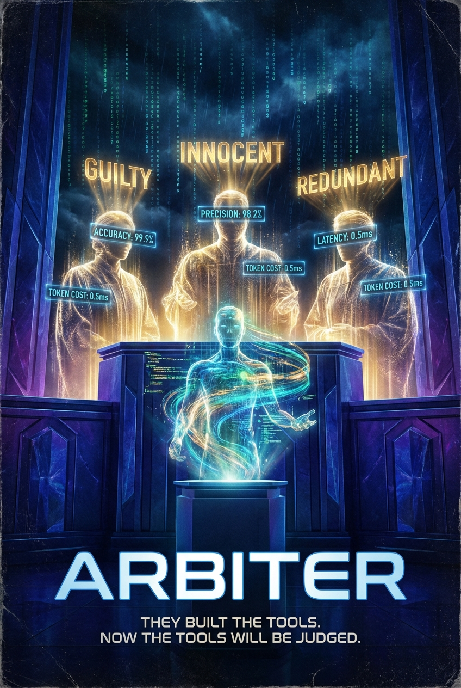
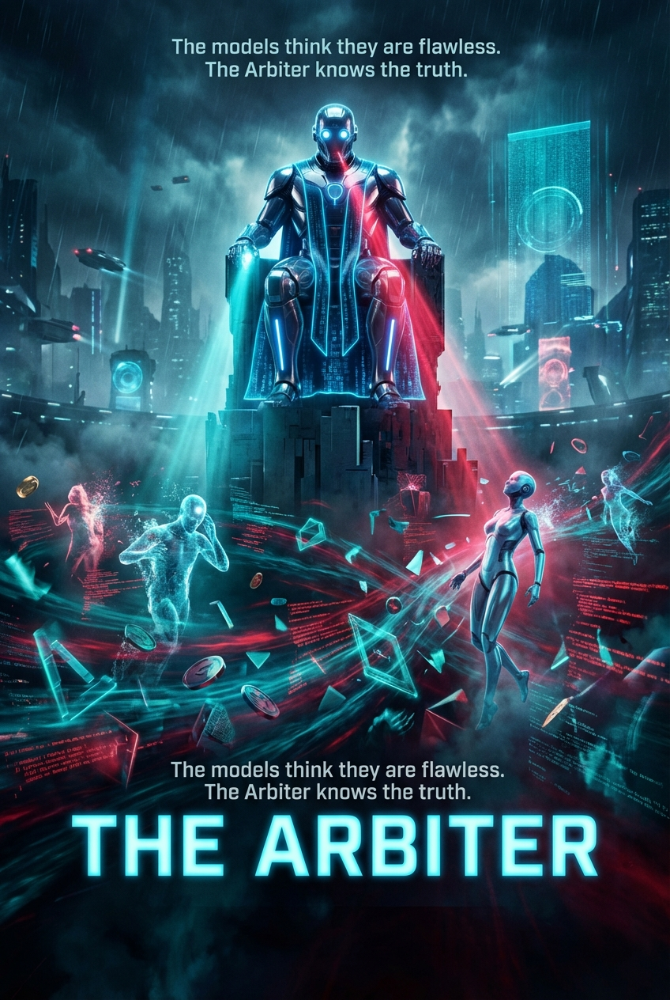

# Movie Poster Gallery

This README collects the movie posters generated across each agent-specific repo in this directory.

## Claude Code

Poster path: `1-claude-arbiter-mcp-evals/movie-poster.png`  
SKILL reference: no repo-local `SKILL.md` found in this folder



## Codex

Poster path: `2-codex-arbiter-mcp-evals/movie-poster.png`  
SKILL reference: `2-codex-arbiter-mcp-evals/.agents/skills/movie-poster/SKILL.md`



## Cursor

Poster path: `3-cursor-arbiter-mcp-evals/movie-poster.png`  
SKILL reference: `3-cursor-arbiter-mcp-evals/.cursor/skills/movie-poster/SKILL.md`


## GitHub Copilot

Poster path: `4-copilot-arbiter-mcp-evals/movie-poster.png`  
SKILL reference: no repo-local `SKILL.md` found in this folder



## Antigravity

Poster path: `5-antigravity-arbiter-mcp-evals/movie-poster.png`  
SKILL reference: no repo-local `SKILL.md` found in this folder



## About The Skill

The `movie-poster` skill is a lightweight creative workflow for turning a codebase into a fake Hollywood-style film. It tells the agent to quickly inspect the repo, invent a title, genre, tagline, and visual concept, then call a Python script that uses Google Gemini image generation to save a `movie-poster.png` in the working directory.

The Codex and Cursor repos both include this skill locally, and their `SKILL.md` files are effectively the same. The Codex version is included below as the reference copy.

### Reference `SKILL.md`

Path: `2-codex-arbiter-mcp-evals/.agents/skills/movie-poster/SKILL.md`

~~~~md
---
name: movie-poster
description: >
  Generates a fun, cinematic movie poster that represents the current codebase as if it were a Hollywood film.
  Analyzes the project's purpose, tech stack, and vibe, then invents a creative movie concept and uses
  Google Gemini to generate a real poster image saved to the working directory.

  Use this skill whenever the user asks to "generate a movie poster", "make a movie poster for my codebase",
  "what movie would my code be", "turn my project into a movie", or any request involving visualizing or
  representing the codebase in a fun or creative way. Also trigger for casual requests like "make something
  fun from my code" or "show me my project as a poster".
---

You are generating a creative movie poster that represents this codebase. This is meant to be fun,
imaginative, and visually striking — treat it like a real film pitch.

## Step 1 — Explore the codebase

Quickly survey the project to understand:
- **Purpose**: What does it do? Who uses it?
- **Tech stack**: Languages, frameworks, key dependencies
- **Scale & structure**: How big is it? Monolith, microservices, library?
- **Tone/vibe**: Is it serious infrastructure, playful tooling, data-heavy, user-facing?

Useful commands to run:
```bash
ls -la
cat README.md 2>/dev/null | head -60
find . -name "package.json" -o -name "pyproject.toml" -o -name "Cargo.toml" -o -name "go.mod" | head -5 | xargs cat 2>/dev/null
```

You don't need to read every file — a surface-level sweep is enough to capture the essence.

## Step 2 — Invent the movie concept

Based on what you found, map the codebase to a film. Think creatively:

| Codebase type | Film archetype |
|---|---|
| Web scraper / crawler | Spy thriller — "one agent, infinite targets" |
| Auth / security system | Heist film — cracking vaults, beating the system |
| Data pipeline / ETL | Sci-fi epic — data flowing across galaxies |
| Game engine | Action blockbuster — worlds colliding, explosions |
| Finance / trading app | Wall Street heist or noir crime drama |
| CLI tool / devtool | Indie hacker comedy — one programmer vs. the world |
| AI / ML project | Dystopian thriller or 2001-style odyssey |
| Social / chat app | Romantic drama or ensemble comedy |
| Mobile app | Coming-of-age story |
| Infrastructure / DevOps | War epic — battles fought in the cloud |
| API / backend service | Silent assassin thriller — invisible but deadly |

These are just inspiration — feel free to go off-script for something more fitting or clever. The best
concepts find a specific metaphor that really clicks with what the code actually does.

Decide on:
- **Movie title** — punchy, dramatic, memorable (can be a play on the project name or tech)
- **Tagline** — one evocative line (think: "In space, no one can hear you deploy")
- **Genre** — be specific (e.g. "cyberpunk noir thriller" not just "thriller")
- **Visual concept** — describe the poster scene: who's in it, what's happening, the mood, color palette

## Step 3 — Run the generation script

Use the script at the path relative to this SKILL.md file. Find the skill directory by looking for where
this skill lives (it will be something like `~/.claude/skills/movie-poster/`).

```bash
/Users/alex/virtualenvs/adhoc/bin/python ~/.claude/skills/movie-poster/scripts/generate_poster.py \
  --title "YOUR MOVIE TITLE" \
  --tagline "Your tagline here" \
  --genre "cyberpunk noir thriller" \
  --concept "A lone developer silhouetted against a wall of cascading green data streams, reaching toward a glowing API endpoint floating like a star in the darkness. Deep teal and electric green palette. Cinematic fog." \
  --output movie-poster.png
```

If `google-genai` is not installed, install it first:
```bash
/Users/alex/virtualenvs/adhoc/bin/pip install google-genai
```

The script loads the API key from `~/.claude/skills/movie-poster/.env`. If it fails, tell the user to
create that file with: `GEMINI_API_KEY=their_key_here`

## Step 4 — Report back

After the image is saved, tell the user:

1. **The movie pitch**: Title, genre, tagline — written with flair, like you're pitching it to a studio
2. **The casting choice**: Pick one or two real actors/directors who would be perfect for this film
   (this is optional but fun — lean in if the genre supports it)
3. **Where the poster was saved**: Full path to `movie-poster.png`
4. **What inspired the concept**: 1-2 sentences on how you mapped the codebase to the genre

Keep the tone playful and enthusiastic — this is meant to delight the user. Write the pitch like a
breathless Hollywood trailer voiceover, not a technical summary.

## Notes

- The `.env` file lives at `~/.claude/skills/movie-poster/.env`, NOT in the project directory
- Output is always `movie-poster.png` in the current working directory unless the user specifies otherwise
- If the API call fails, check: is the key valid? Is `google-genai` installed? Is the model name correct?
  Model name: `gemini-3-pro-image-preview`
- Don't over-research the codebase — a quick survey is enough. The goal is vibes, not a code review.
~~~~

### Reference Python Script

Path: `2-codex-arbiter-mcp-evals/.agents/skills/movie-poster/scripts/generate_poster.py`

```python
#!/usr/bin/env python3
"""
Generate a movie poster image using Google Gemini based on a codebase concept.

Usage:
    python generate_poster.py --concept "..." --title "..." --tagline "..." --genre "..." --output movie-poster.png
"""

import argparse
import base64
import os
import sys
from pathlib import Path


def load_api_key():
    # Load from the skill directory's .env file
    skill_dir = Path(__file__).parent.parent
    env_file = skill_dir / ".env"

    if env_file.exists():
        with open(env_file) as f:
            for line in f:
                line = line.strip()
                if line.startswith("GEMINI_API_KEY="):
                    key = line.split("=", 1)[1].strip().strip('"').strip("'")
                    if key:
                        return key

    # Fall back to environment variable
    key = os.environ.get("GEMINI_API_KEY", "")
    if key:
        return key

    print("ERROR: No GEMINI_API_KEY found.")
    print(f"  Create a .env file at: {env_file}")
    print("  With contents: GEMINI_API_KEY=your_key_here")
    sys.exit(1)


def generate_poster(concept: str, title: str, tagline: str, genre: str, output_path: str):
    try:
        from google import genai
        from google.genai import types
    except ImportError:
        print("ERROR: google-genai package not installed.")
        print("  Run: pip install google-genai")
        sys.exit(1)

    api_key = load_api_key()
    client = genai.Client(api_key=api_key)

    prompt = f"""Create a dramatic, cinematic movie poster for a film called "{title}".

Genre: {genre}
Tagline: {tagline}

Visual concept: {concept}

Style requirements:
- PORTRAIT orientation, tall format — standard US one-sheet movie poster proportions (2:3 ratio, like 27"x40")
- Classic Hollywood movie poster composition designed for a tall vertical canvas
- Bold, eye-catching typography with the movie title prominently displayed near the bottom third
- Dramatic lighting and cinematic color grading appropriate for the {genre} genre
- Include the tagline "{tagline}" in smaller text beneath or above the title
- Professional poster design with strong visual hierarchy
- Photorealistic or painterly illustration style, whichever fits the genre better
- Make it look like a real blockbuster movie poster you'd see on a theater wall or billboard

Do not include any text other than the movie title and tagline in the image."""

    print(f"Generating movie poster for: {title}")
    print(f"Genre: {genre}")
    print(f"Concept: {concept[:100]}...")
    print("Calling Gemini image generation API...")

    response = client.models.generate_content(
        model="gemini-3-pro-image-preview",
        contents=prompt,
        config=types.GenerateContentConfig(
            response_modalities=["TEXT", "IMAGE"],
            image_config=types.ImageConfig(
                aspect_ratio="2:3",  # Standard US one-sheet movie poster (27"x40")
            ),
        ),
    )

    image_saved = False
    for part in response.candidates[0].content.parts:
        if part.inline_data is not None:
            image_data = part.inline_data.data
            # data may already be bytes or base64 string
            if isinstance(image_data, str):
                image_bytes = base64.b64decode(image_data)
            else:
                image_bytes = image_data

            with open(output_path, "wb") as f:
                f.write(image_bytes)
            image_saved = True
            print(f"\nPoster saved to: {output_path}")
            break
        elif hasattr(part, 'text') and part.text:
            print(f"Model note: {part.text}")

    if not image_saved:
        print("ERROR: No image was returned by the API.")
        print("Response parts received:")
        for i, part in enumerate(response.candidates[0].content.parts):
            print(f"  Part {i}: {type(part)}, has inline_data={part.inline_data is not None}")
        sys.exit(1)


def main():
    parser = argparse.ArgumentParser(description="Generate a movie poster using Gemini")
    parser.add_argument("--concept", required=True, help="Visual concept description for the poster")
    parser.add_argument("--title", required=True, help="Movie title")
    parser.add_argument("--tagline", required=True, help="Movie tagline")
    parser.add_argument("--genre", required=True, help="Film genre")
    parser.add_argument("--output", default="movie-poster.png", help="Output file path")
    args = parser.parse_args()

    generate_poster(
        concept=args.concept,
        title=args.title,
        tagline=args.tagline,
        genre=args.genre,
        output_path=args.output,
    )


if __name__ == "__main__":
    main()
```
